

## Project Webpages Week 1-2
### Home Page
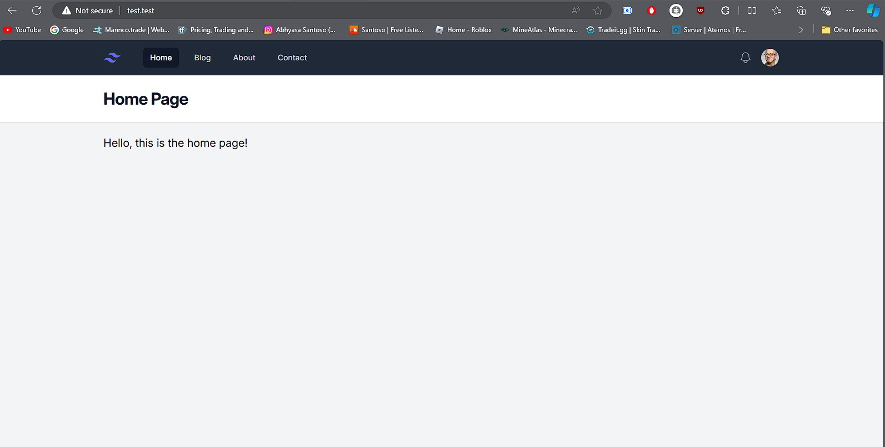
This page is what the homepage of my website looks like in it's first state. It is still quite plain and I'm using a layout design from tailwind.

### Blog Page

This is the blog page where I may post some stuff if I'm able to code it. It is also using a layout design from tailwind.

### About Page

This is the about page where I may post some stuff about muyself. It is also using a layout design from tailwind.

### Contact Page
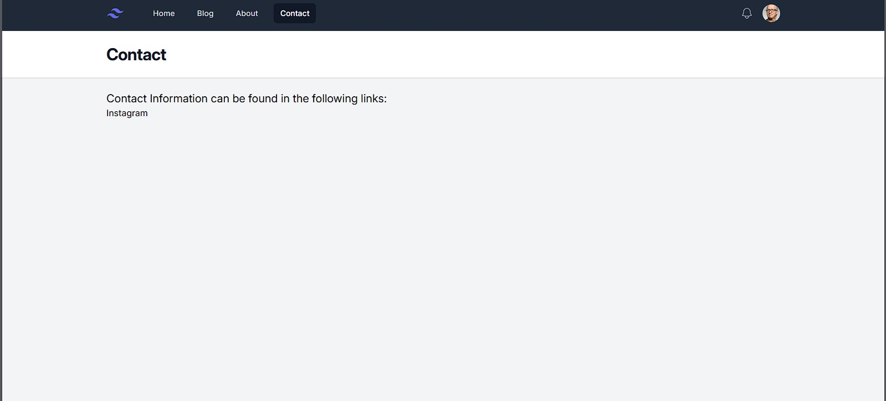
This is the contact page where perhaps I will share my social media links and information for people to get in contact with me. It is also using a layout design from tailwind.

## Project Webpages Week 3
### Updated Blog Page

The only updated page this week was the blog page, we've added multiple articles to the blog page. These articles can then be opened by clicking the `Read more` link or the `title of the article`. The articles will then be viewed in their own seperate webapges like in the following screenshots

### Article 1 web page

The image above is what the web page of article 1 loooks like. The text is complete compared to the previewd and shorter version in the blog page.

### Article 2 web page

Same with the article 1 web page, article 2 also has the complete text compared to the shorter text in the blog page.

## Project Webpages Week 4
### Updated Blog Page
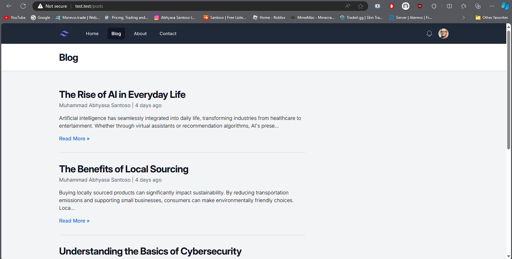
Similar to the previous week, the only updated page this week was the blog page. We've added multiple articles to the blog page with readable text. 

### Article 1
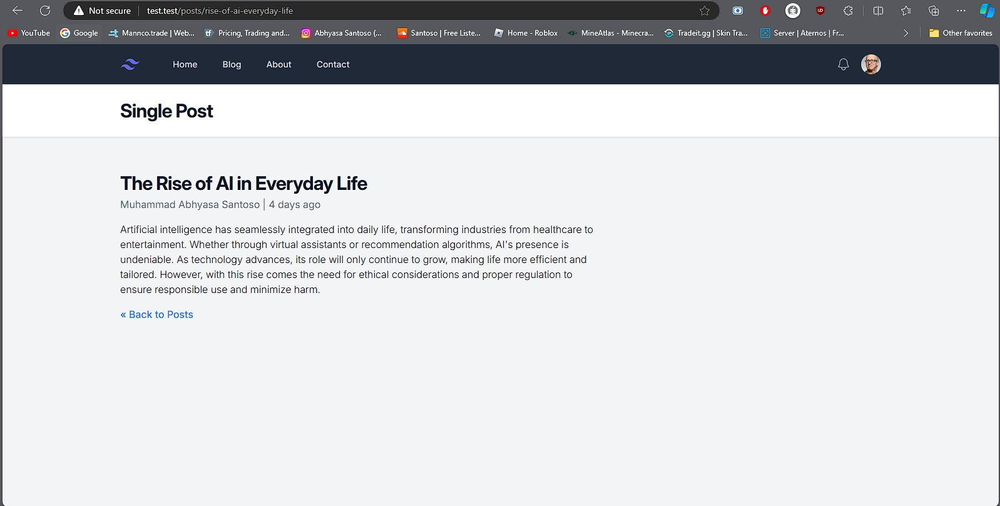

### Article 2
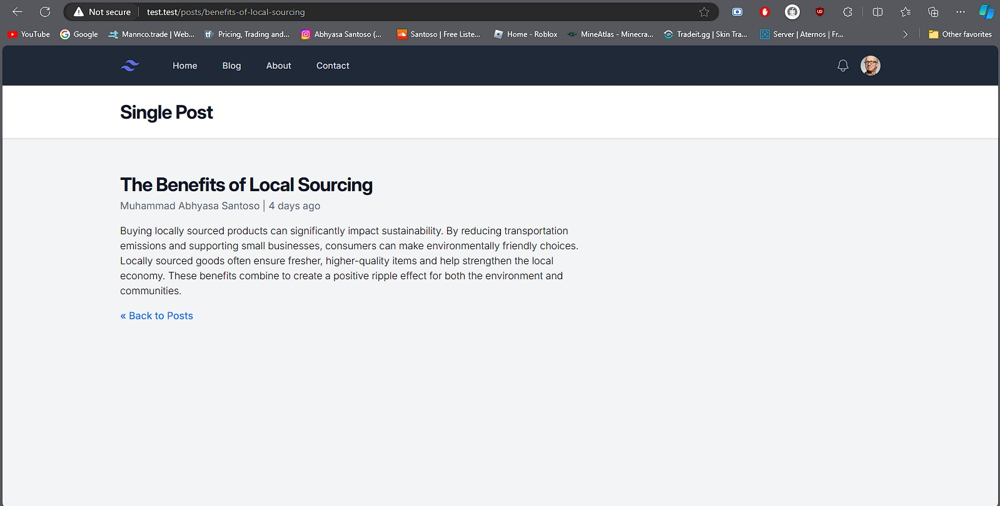

### Article 3
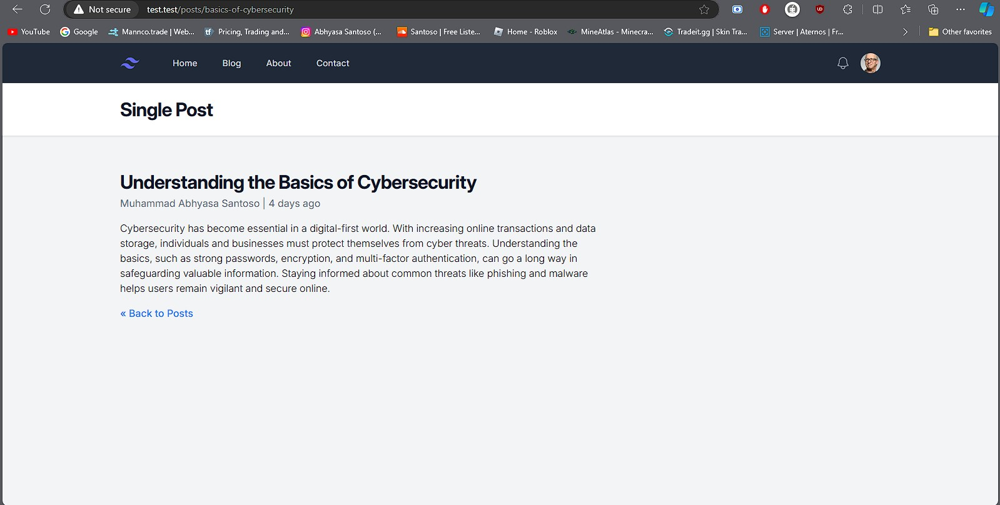

### Article 4
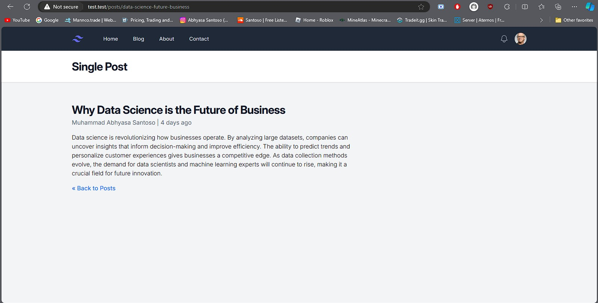

### Article 5
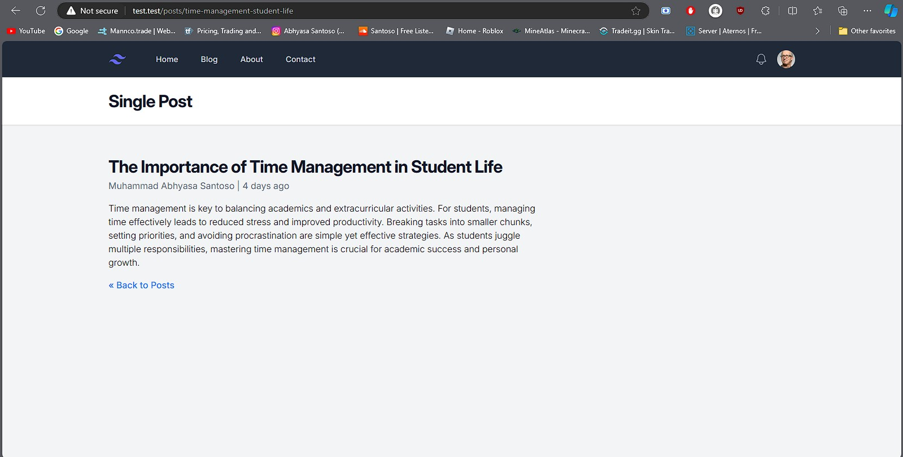

### Difference in Database
Visually there are no differences besides the text, but behind it all is the difference in the code. 

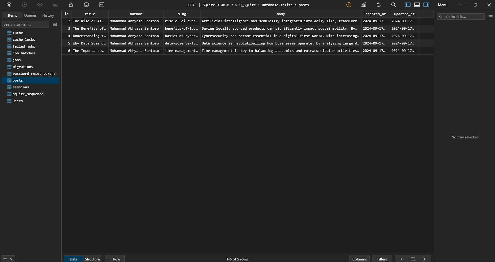

Using techniques such as `database`, `migration`, `Eloquent ORM`, and `Post Model`. We can now dynamically insert data using `php artisan tinker` into the databse on `tableplus`.

## Week 5
### Updated Blog Page
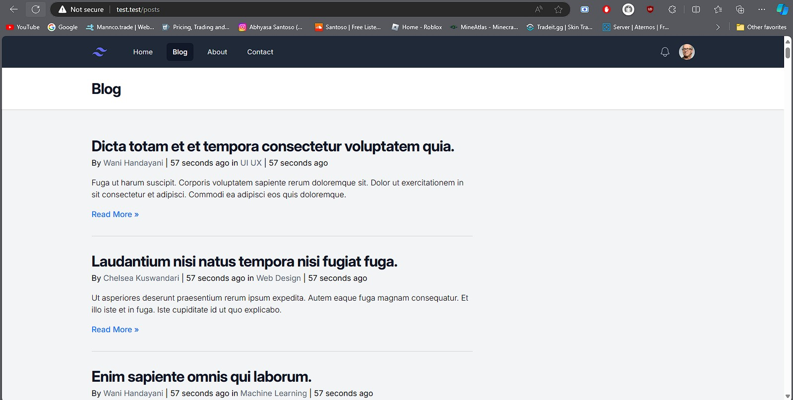
Similar to the previous week, the only updated page this week was the blog page. We've added many more articles using using `database seeders`. This makes it so we can insert specified amounts of certain tables with already preset functions from laravel such as inserting sentences, local or international names, usernames, hashed passwords, etc. `Databse seeders` helps alot when you want to insert lots of fake data to see if your database works and how it may be displayed on yout website.

### "Articles By" Feature
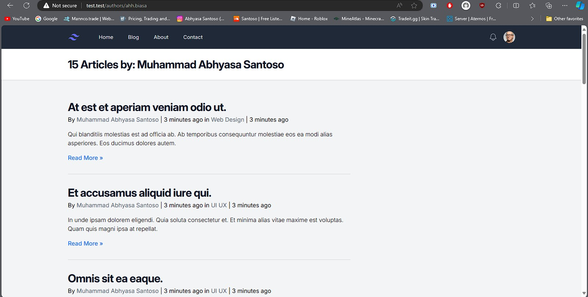
There's also a new feature where we can view all articles from a single user. This can be viewed by simply cliking on the username on the article of your choice. This feature sort of acts as the profile of each user that has posted an article.

### Category Feature
There's also a category feature where we can view articles from specific categories.

### Category 1
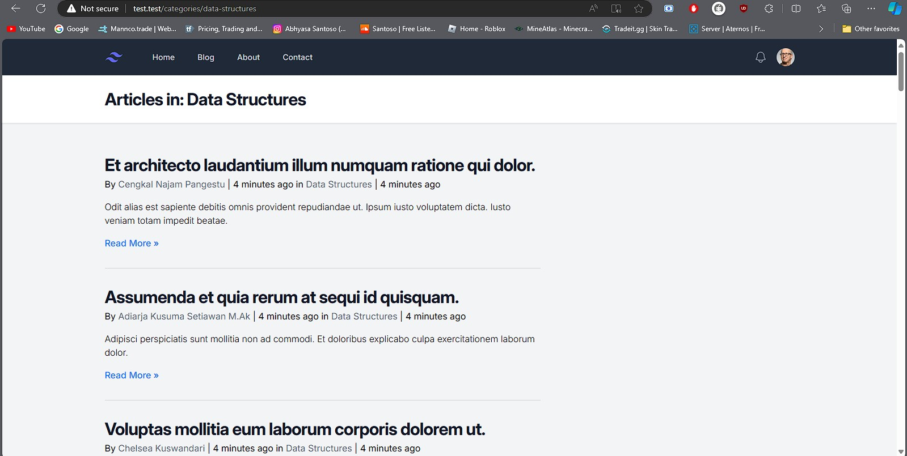

### Category 2
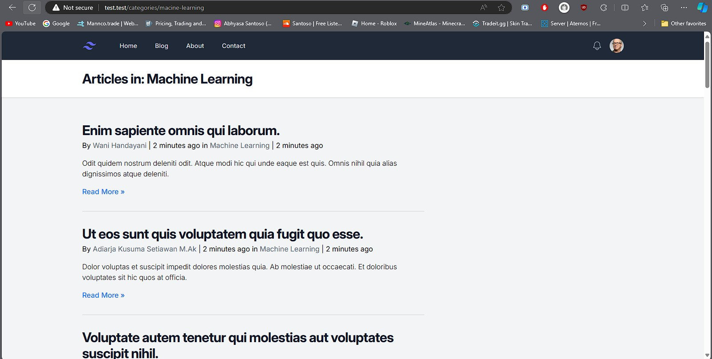

### Category 3
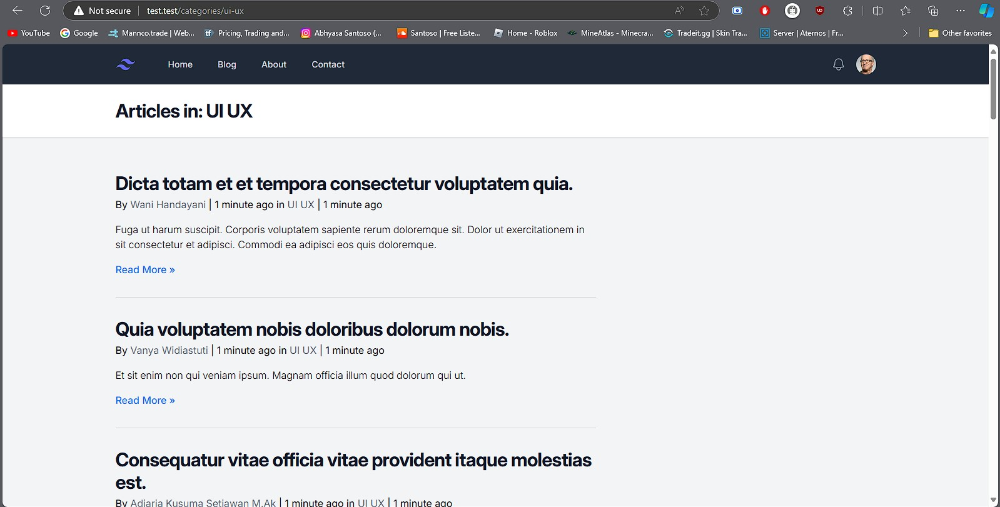

### Category 4
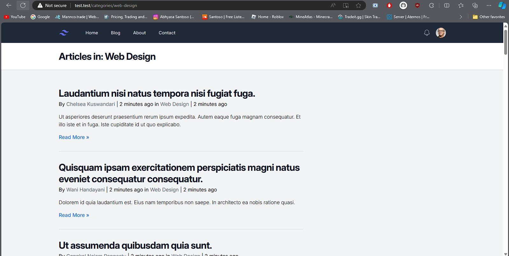

## About Laravel

Laravel is a web application framework with expressive, elegant syntax. We believe development must be an enjoyable and creative experience to be truly fulfilling. Laravel takes the pain out of development by easing common tasks used in many web projects, such as:

- [Simple, fast routing engine](https://laravel.com/docs/routing).
- [Powerful dependency injection container](https://laravel.com/docs/container).
- Multiple back-ends for [session](https://laravel.com/docs/session) and [cache](https://laravel.com/docs/cache) storage.
- Expressive, intuitive [database ORM](https://laravel.com/docs/eloquent).
- Database agnostic [schema migrations](https://laravel.com/docs/migrations).
- [Robust background job processing](https://laravel.com/docs/queues).
- [Real-time event broadcasting](https://laravel.com/docs/broadcasting).

Laravel is accessible, powerful, and provides tools required for large, robust applications.

## Learning Laravel

Laravel has the most extensive and thorough [documentation](https://laravel.com/docs) and video tutorial library of all modern web application frameworks, making it a breeze to get started with the framework.

You may also try the [Laravel Bootcamp](https://bootcamp.laravel.com), where you will be guided through building a modern Laravel application from scratch.

If you don't feel like reading, [Laracasts](https://laracasts.com) can help. Laracasts contains thousands of video tutorials on a range of topics including Laravel, modern PHP, unit testing, and JavaScript. Boost your skills by digging into our comprehensive video library.

## Laravel Sponsors

We would like to extend our thanks to the following sponsors for funding Laravel development. If you are interested in becoming a sponsor, please visit the [Laravel Partners program](https://partners.laravel.com).

### Premium Partners

- **[Vehikl](https://vehikl.com/)**
- **[Tighten Co.](https://tighten.co)**
- **[WebReinvent](https://webreinvent.com/)**
- **[Kirschbaum Development Group](https://kirschbaumdevelopment.com)**
- **[64 Robots](https://64robots.com)**
- **[Curotec](https://www.curotec.com/services/technologies/laravel/)**
- **[Cyber-Duck](https://cyber-duck.co.uk)**
- **[DevSquad](https://devsquad.com/hire-laravel-developers)**
- **[Jump24](https://jump24.co.uk)**
- **[Redberry](https://redberry.international/laravel/)**
- **[Active Logic](https://activelogic.com)**
- **[byte5](https://byte5.de)**
- **[OP.GG](https://op.gg)**

## Contributing

Thank you for considering contributing to the Laravel framework! The contribution guide can be found in the [Laravel documentation](https://laravel.com/docs/contributions).

## Code of Conduct

In order to ensure that the Laravel community is welcoming to all, please review and abide by the [Code of Conduct](https://laravel.com/docs/contributions#code-of-conduct).

## Security Vulnerabilities

If you discover a security vulnerability within Laravel, please send an e-mail to Taylor Otwell via [taylor@laravel.com](mailto:taylor@laravel.com). All security vulnerabilities will be promptly addressed.

## License

The Laravel framework is open-sourced software licensed under the [MIT license](https://opensource.org/licenses/MIT).
